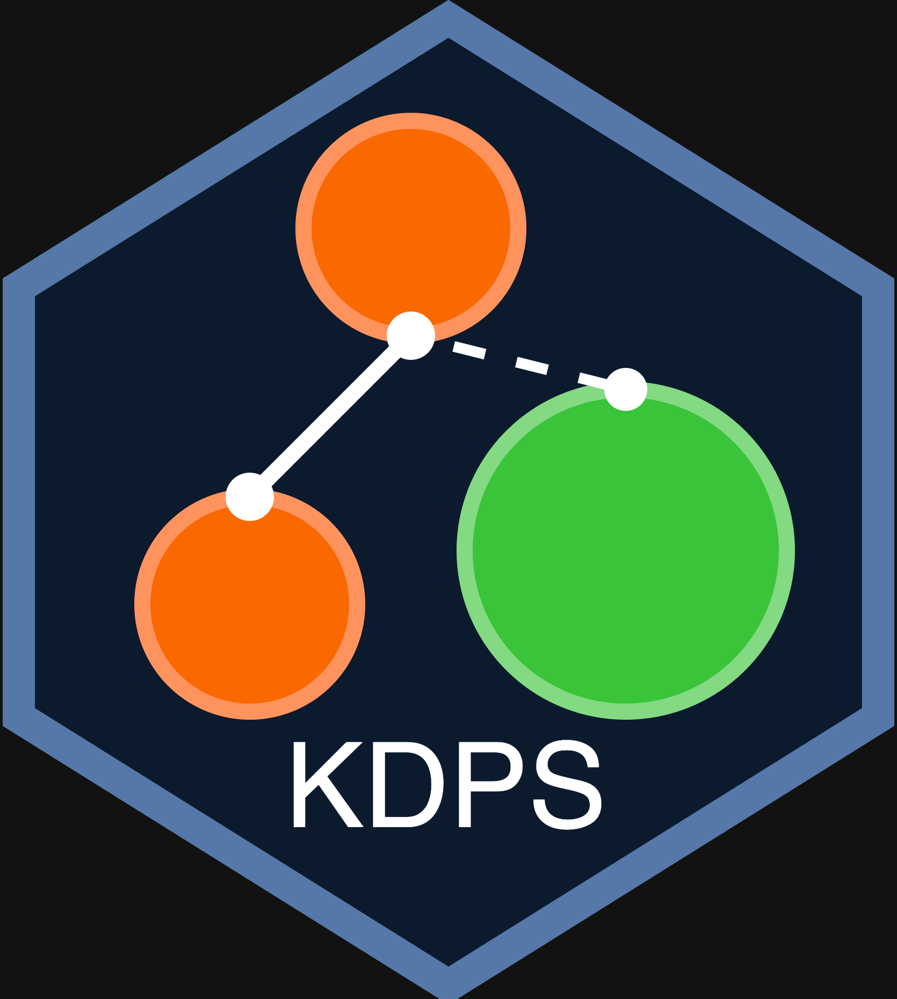

<!-- README.md is generated from README.Rmd. Please edit that file -->

```{r, include = FALSE}
knitr::opts_chunk$set(
  collapse = TRUE,
  comment = "#>",
  fig.path = "man/figures/README-",
  out.width = "100%"
)
```

# Kinship Decouple and Phenotype Selection (KDPS) <a href="https://github.com/Broccolito/kdps"></a>

<!-- badges: start -->
[](https://github.com/Broccolito/kinclean/actions/workflows/R-CMD-check.yaml)
<!-- badges: end -->

The goal of KDPS is to remove related subjects based on kinship matrix as well as subject phenotype

## Installation

You can install the development version of kdps from [GitHub](https://github.com/) with:

```{r,eval=FALSE}
if(!require("devtools")){
  install.packages("devtools")
  library("devtools")
}

devtools::install_github("Broccolito/kdps")
```

## Example

This is a basic example showing how to use the `kdps` function:
```{r example,eval=FALSE}
library(kdps)
subject_to_remove = kdps(phenotype_file = file.path(system.file("extdata", package = "kdps"), 
                                                    "simple_pheno.txt"),
                         kinship_file = file.path(system.file("extdata", package = "kdps"), 
                                                    "simple_kinship.txt"),
                         fuzziness = 0,
                         phenotype_name = "pheno2",
                         prioritize_high = FALSE,
                         prioritize_low = FALSE,
                         phenotype_rank = c("DISEASED1", "DISEASED2", "HEALTHY"),
                         # Header names in the phenotype file
                         fid_name = "FID",
                         iid_name = "IID",
                         # Header names in the kinship file
                         fid1_name = "FID1",
                         iid1_name = "IID1",
                         fid2_name = "FID2",
                         iid2_name = "IID2",
                         kinship_name = "KINSHIP",
                         kinship_threshold = 0.0442,
                         phenotypic_naive = FALSE)
```

In this example, the phenotype file looks like:

| FID|  IID|pheno1   |pheno2    | pheno3|
|---:|----:|:--------|:---------|------:|
|   0| 1001|DISEASED |DISEASED2 | 109.50|
|   0| 1002|HEALTHY  |HEALTHY   | 117.18|
|   0| 1003|HEALTHY  |HEALTHY   |  90.41|
|   0| 1004|HEALTHY  |HEALTHY   |  95.00|

The kinship file looks like:

| FID1| IID1| FID2| IID2| HetHet|   IBS0| KINSHIP|
|----:|----:|----:|----:|------:|------:|-------:|
|    0| 1001|    0| 1002|  0.037| 0.0083|       1|
|    0| 1003|    0| 1004|  0.046| 0.0148|       1|

The real-life datasets are usually much longer but should always contain the sample key components:

Phenotype file: FID, IID, phenotype (binary, categorical, numerical)
Kinship file: FID1, IID1, FID2, IID2, Kinship score or IBS score.


